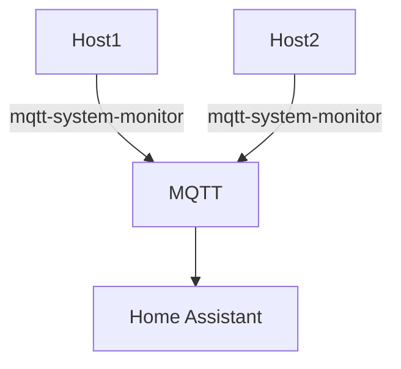

# mqtt-system-monitor  [![][img_crates]][crates] [![][img_doc]][doc]

`mqtt-system-monitor` is a small program that periodically sends reports with MQTT to Home Assistant.



## Configuration

The configuration file is `/etc/mqtt-system-monitor.conf`. The available configuration settings are:

* `log-verbosity`: Log verbosity. Default = `2` (warning)
  * 1 => Error
  * 2 => Warning
  * 3 => Info
  * 4 => Debug
  * 5 => Trace
* `mqtt.hostname`: hostname of the MQTT broker. `localhost` by default
* `mqtt.port`: port of the MQTT broker. `1883` by default
* `mqtt.user`: user for the MQTT broker connection. empty by default
* `mqtt.password`: password for the MQTT broker connection. empty by default
* `mqtt.entity`: Name of the device. Defaults to the hostname of the machine.
* `mqtt.update-period`: Frequency for polling and updates in seconds. `10` by default
* `mqtt.registration-prefix`: Prefix for the registration topic. `homeassistant` by default. This must match the discovery prefix set in the MQTT configuration.
* `sensors.temperature`: Temperature sensor to monitor. Example : `coretemp Package id 0`
* `sensors.network`: Network interface to monitor. Example : `wlan0`

## Usage

A systemd unit is provided. If used:

```bash
systemctl enable --now mqtt-system-monitor
```

The program can be run as a standalone program:

```bash
/usr/bin/mqtt-system-monitor
```

## Sensors

### cpu_temp

Reports CPU Temperature in °C, if `sensors.temperature` is set

### cpu_usage

Reports the current total CPU usage in %.

### memory_usage

Reports the current memory usage in %.

### net_tx

Reports the rate of outgoing data in KiB/s during the last `mqtt.update-period` seconds, if `sensors.network` is set.

### net_rx

Reports the rate of incoming data in KiB/s during the last `mqtt.update-period` seconds, if `sensors.network` is set.


## Credits

Some code is based on https://github.com/cmargiotta/mqtt-system-monitor which has the same purpose, but I couldn't do what I wanted with just Lua scripts.

[img_crates]: https://img.shields.io/crates/v/mqtt-system-monitor.svg
[img_doc]: https://img.shields.io/badge/rust-documentation-blue.svg

[crates]: https://crates.io/crates/mqtt-system-monitor
[doc]: https://docs.rs/mqtt-system-monitor/
